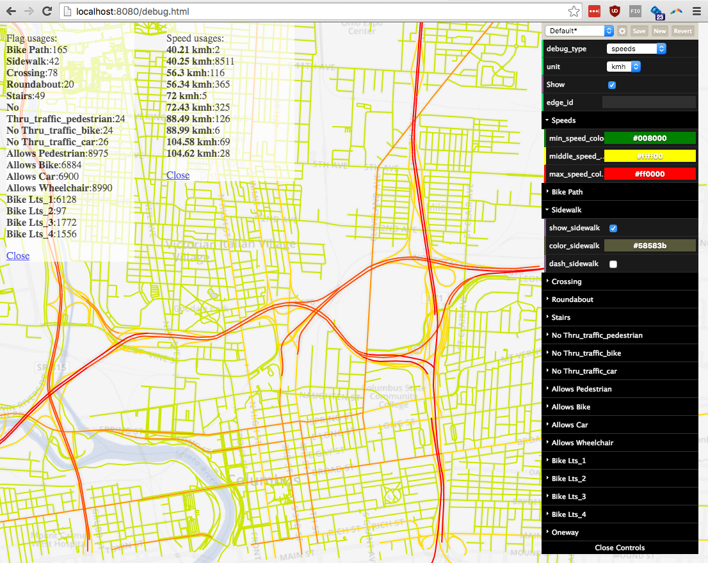

# Advanced Usage

## Debug Interface

When running R5 as a point to point router (with the `--point` parameter), a debug web interface is available to visualize the details of the street graph.
It is available at [http://localhost:8080/debug.html].

